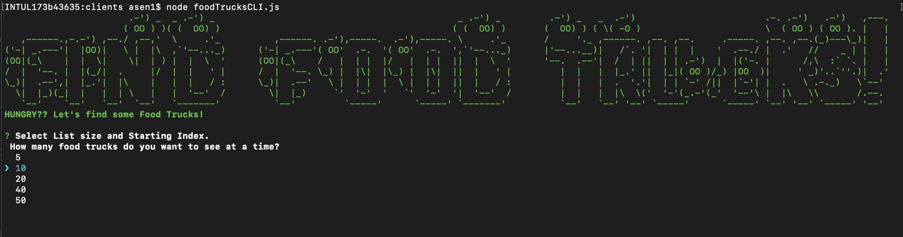
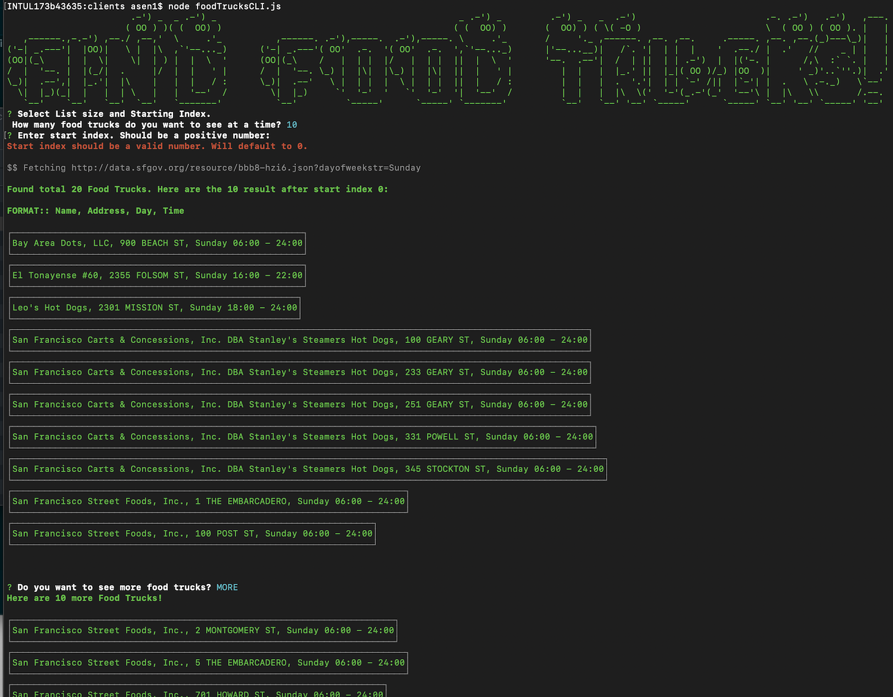
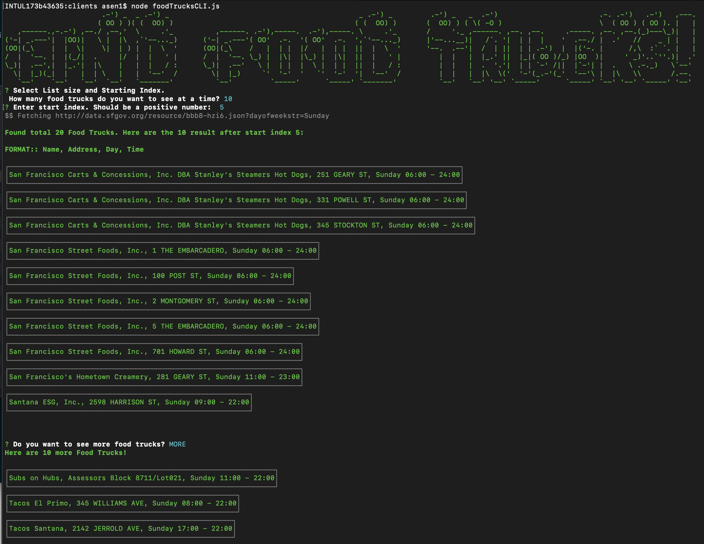

This is a toy CLI to print out a list of food trucks that are open at the current date and current time. 
For ease of use, user can view the results few at a time. 

### CLI Installation
1. Install Node. `node --version` >= v8.16.0. Use NVM to switch between node versions.
    a. Tested with node versions v8.16.0, v10.16.1, v12.7.0
2. `cd path-to-foodTruckFinder/src/clients`
3. Install dependencies. Run `npm install`

### Run CLI
1. `cd src/clients/`
2. Run `node foodTrucksCLI.js`
3. Choose how you want to view the results
    - Choose number of results shown in each page, 
    - Optional: Choose the start index. (Example: If you want to see results from 10 onwards)
    - Select More to view more results
    - Select End to exit
4. Run tests to check outputs for different input records: `npm test`
5. Attached Sample outputs from Nov 3, 9:50pm: ./Output_FoodTrucksOpenNow_*.png

## CLI Design Considerations

### Service layer
Data Source: Socrata API https://dev.socrata.com/foundry/data.sfgov.org/jjew-r69b

Assumptions
- The API Results are already Unique by (applicant and location)
- Users should be ok with a 1 day fresh, Food Truck data.

#### Performance:
To reduce the network payload, I have used the "week day" filter of the Socrata API. This reduced the payload by ~80%.
If the Response is much larger (big data problem), and if there are use cases to query this data, 
then Distributed Caching can be used to cache and index, the Socrata API results. 
For Simplicity, currently I have a brute-force in-memory cache, with 1 day refresh, in the Service layer.

#### Security:
Since Food Truck data is not sensitive data, I have currently used http, and not https.
Also, since this is public data, and I don't plan to send too much traffic from this CLI, 
I have not used an AppToken to identify my app.

### Modular Components
Modular code design For Extensibility. The Application Config and Enum constant are kept in different modules.
Filtering and Sorting logic can be changed easily in the Utils, without impacting the CLI or Service layers.
 
1. CLI: src/clients/foodTrucksCLI.js 
2. App Config: src/config/appConfig.js
3. Service layer: src/services/FoodTruckFinder.js
4. Models: src/models/FoodTruck.js
5. Enums: src/enums/enums.js
6. Unit tests: test/utils.test.js

### CLI Design
Ease of Use:
For ease of use, user can view the results few at a time. 
- At the beginning user can select size of each list
- the starting point (may be handy if the user is viewing the result multiple times)
- User can choose to view More or Exit the CLI
- Results are sorted by the Food Truck's name. This version does not sort by location.
- Some Minimal formatting is used to help the user read each result

CLI Questions can be easily updated without impacting logic, in src/config/cliQuestions.js

